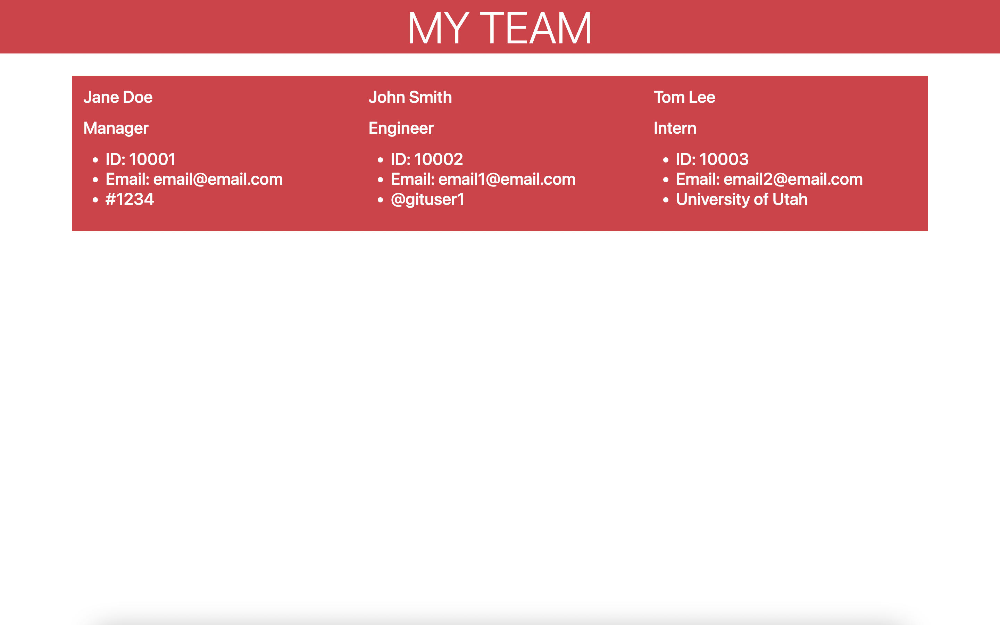

# team-profile-generator
## Purpose
Purpose of this project is to generate a team profile. When users are finished answering the questions there will be an HTML file generated with the user input.
## Usage
Terminal has to be open, use "node index" command to initiate questions to generate team profile.
## Built With
* HTML
* JS
## Moving Forward
I would look like to make it more visually appealing by adding more bootstrap
## Lessons Learned
How to utilize inquirer
## Resources
I got help from my tutor, TA's, & classmates
### Web link:
- Live Link [website](https://vhivestate.github.io/team-profile-generator/)
- Video Link [website](https://drive.google.com/file/d/1vRuIeeM3yyzHILKNHXzOo0ULqdiG38dh/view)
- Test Video Link [website](https://drive.google.com/file/d/1O0jxOuquwx2BH43AZrrwqGpJ9Jua5C27/view)
## Screenshot & Video

## Contribution
Made with ❤️ by Valeria Garcia